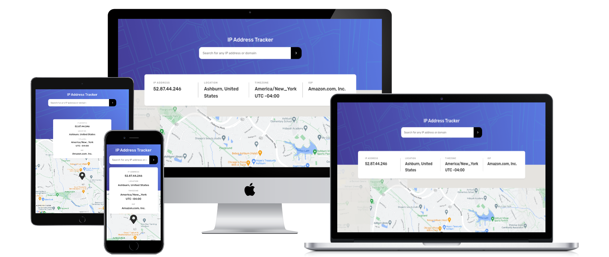

# IP Address Tracker app - Frontend Mentor Challenge

Developer: Robin Bosch  
Designed by Frontend Mentor

[View live Site](https://ip-address-tracker-frontend-mentor.vercel.app/)  

## Table of contents

- [Overview](#overview)
    - [The challenge](#the-challenge)
    - [Designs](#designs)
- [My process](#my-process)
    - [Challenges](#challenges)
    - [What I learned](#what-i-learned)
- [Technologies used](#technologies-used)
    - [Languages](#languages)
    - [Framework](#framework)
    - [Libraries](#libraries)
- [Validation and Testing](#validation-and-testing)
- [Author](#author)
- [Credits](#author)
- [Acknowledgments](#acknowledgments)
- [License](#license)

## Overview

### The challenge

Users should be able to:

- View the optimal layout for each page depending on their device's screen size
- See hover states for all interactive elements on the page
- See their own IP address on the map on the initial page load
- Search for any IP addresses or domains and see the key information and location

### Designs

The following designs were given to build the project:  

The Desktop design with a shown width of 1440px

Hover states

The Mobile design with a shown width of 375px

## My process

### Challenges

- Getting google maps to run on react. The most popular library has problems with the marker not staying in its position. 
- Getting the ip address on first load, as the new app router of Next.JS does not expose the request object anymore, I had to switch back to the pages router.
- Access the API when deployed as a HTTP request is not working, when the webpage is requested via HTTPS.

#### Challenges of new Version

- Replacing google maps with leaflet after google introduced the new street colours and the api key not working correctly anymore.
- Creating a custom marker with react-leaflet while using the icons from the react-icons library.

### What I learned

- The differences between the pages and app router in Next.JS.
- The Google API system and its billing.
- Various server locations where a preview of my site was generated (little fun fact).

#### What I learned with the new version

- A better usage for useMemo, never really used useMemo before.
- The differences between google maps and leaflet when integrating a map. They are quite different in their usage.

## Technologies used

### Languages

- HTML
- CSS
- TypeScript

### Frameworks

- Next.JS (page router)
- SASS (SCSS)

### Libraries

- react-leaflet
- react-icons

## Validation and Testing

### HTML Validation

HTML validation was done with the [W3 HTML validator](https://validator.w3.org/nu/) and came back with no warnings.

### CSS Validation

CSS validation was done with the [W3 CSS validator](https://jigsaw.w3.org/css-validator/) and came back with warnings regarding the variables which are currently not checked.

### Accessibility Testing

Accessibility was checked with the browser extension of the [WAVE validator](https://wave.webaim.org/) and came back with errors in the contrast given by the design.

### Device Testing

The website was tested on the following devices:

- Windows 11 PC (Screen resolution: 2560x1440)
- Xiaomi MI 9 with Android 11 (Screen resolution: 1080x2280)
- Xiaomi Pad 6 with Android 12 (Screen resolution: 1800x2880)

Other screen resolutions were tested in the browser with dev tools from 2560x1440 down to 320x568.

### Useful resources

Two helpful reference guides I use: 
- [Grid Guide](https://css-tricks.com/snippets/css/complete-guide-grid/)
- [Flexbox Guide](https://css-tricks.com/snippets/css/a-guide-to-flexbox/)

Helpful for regex patterns:
- [ChatGPT](https://chat.openai.com/)

## Credits

- [Frontend mentor](https://www.frontendmentor.io) - For providing me with [this challenge and the designs.](https://www.frontendmentor.io/challenges/ip-address-tracker-I8-0yYAH0) 
- [Reset CSS](https://andy-bell.co.uk/a-modern-css-reset/) from Andy Bell

## License

This project is published under the MIT license.  
The challenge itself is excluded from this license.  
[License](/LICENSE.txt)
